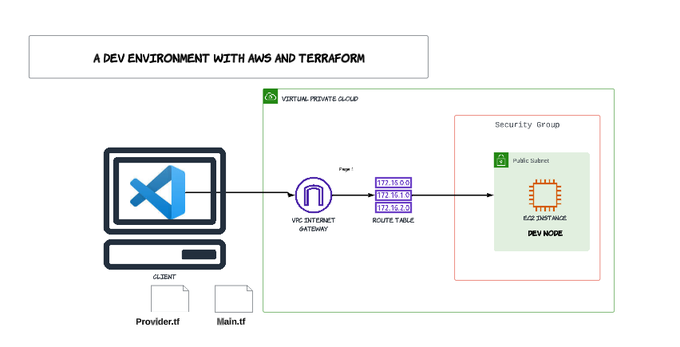

# TERRAFORM PROVISIONING WITH AWS
## Introduction to Terraform
Terraform is the infrastructure as code (IaC) tool from HashiCorp. It is a tool for building, changing, and managing infrastructure in a safe, repeatable way.
It is an open-source infrastructure provisioning tool where you can store your cloud infrastructure setup as codes. For more reading https://developer.hashicorp.com/terraform/intro

This project involves creating a simple dev environment with AWS and Terrafrom, below is an architectural diagram displaying the AWS resource.

An IAM user was already created with an administration access granted to the user (default).
VS code was used which required the installation of AWS Toolkits and the Terraform extension; AWS connection was then created with the Access key ID and Secret access key generated from the management console, which generated the aws resources in the US East 1 (N. Virginia) region.

## The Terraform init

